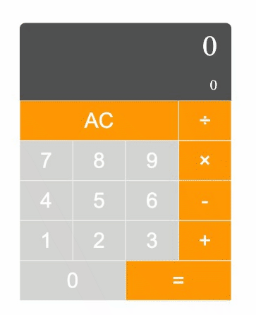

# Calculator

A calculator built with JavaScript. It has two screens: top for a result and bottom for showing the process.

## 🛠 Skills

HTML5, CSS, JavaScript

## Lessons Learned

- CSS grid
- Switch statement
- Type of e.target.value is string
- isNaN function

## Demo

